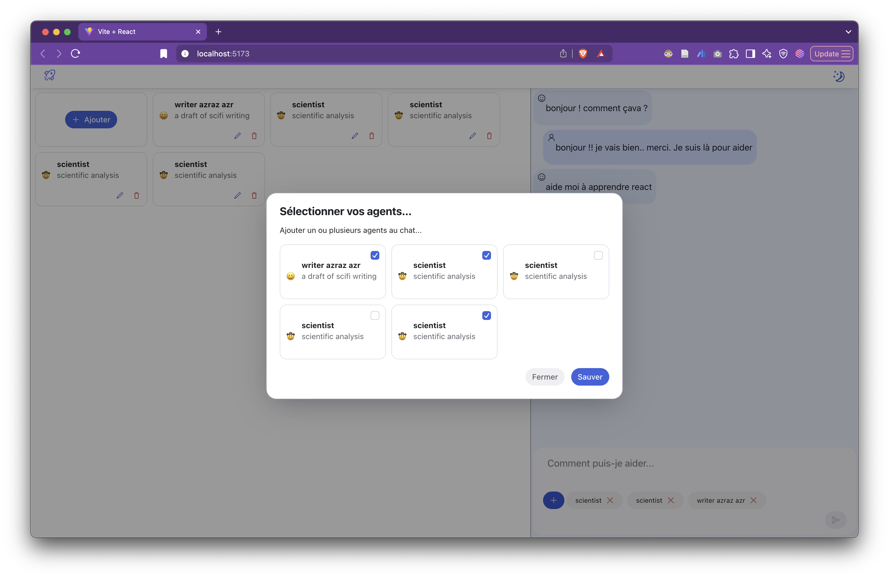

# But3 - Agent-Collab App - Partie 3
L’objectif de cette partie est de produire la vue menu des agents qui est intégrée au ChatPrompt (bouton “+” bleu). Elle se compose de deux sous parties :

1.  Une vue type ‘Dialog’ (voir radix Dialog) permettant de sélectionner ou désélectionner des agents (appelée AgentMenu)
2.  Une liste horizontale permettant de réordonner les agents sélectionner via le la vue dialog et d’enlever, en cas de besoin, les agents de la liste (appelée AgentSelect). Pour réordonner les agnents on utilise un drag-&-drop

Voici à quoi cela ressemble :

*   Quand je clique sur le call to action (“+”) dans le ChatPrompt, cela ouvre la vue dialog avec la liste des agents existants dans le store

*   La liste des agents est une liste de cartes

*   La carte de l’agent a un Checkbox (voir Checkbox de Radix) pour sélectionner ou désélectionner un agent

*   Utiliser un fichier `chatAgents.js` pour le store des agents dans ChatPrompt

    *   Stocker seulement les ids des agents sélectionnés : `export const $selectedChatAgents = atom([])`

*   Le composant pour `AgentSelect` est déjà founi

